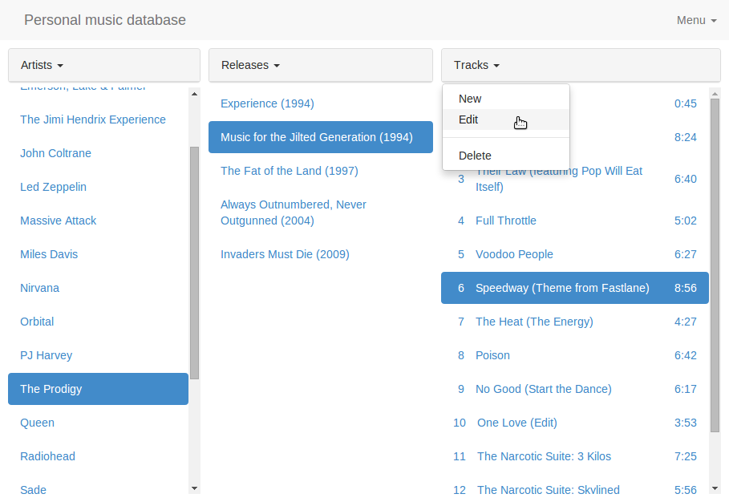

# パーソナル音楽データベース(Webアプリケーション演習)

日本語 | [English](/README.en.md)

個人用音楽データ管理Webアプリケーションです。次のURLで公開しています。データはブラウザのローカル環境にだけ保存されます。外部へアクセスすることはありませんので安心してお使い下さい。

* <http://personal-music-database.herokuapp.com/>

これは以前作成した <https://github.com/higuma/music-db-rails-bb> を元に、データベースの部分をlocalStorageに変更したものです。使用ライブラリは次の通りです。

* [jQuery](http://jquery.com/)
* [Bootstrap](http://getbootstrap.com/)
* [Underscore.js](http://underscorejs.org/)
* [Backbone.js](http://backbonejs.org/)
* [Backbone.localStorage](https://github.com/jeromegn/Backbone.localStorage)

> サンプルデータはWikipediaやDiscogsなどからアーティスト、トラック、タイトルを抽出して作成しました。

